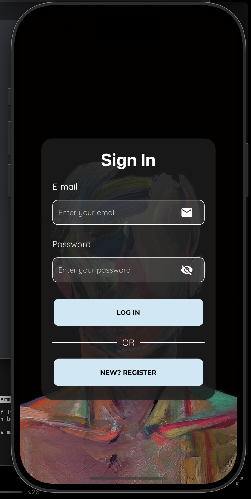
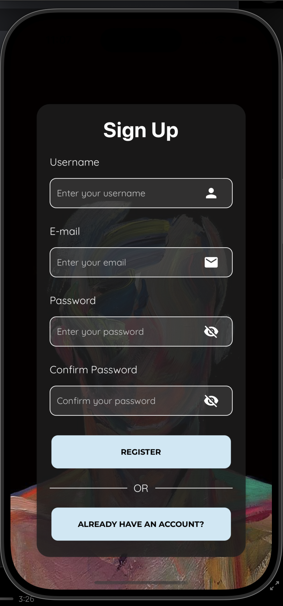
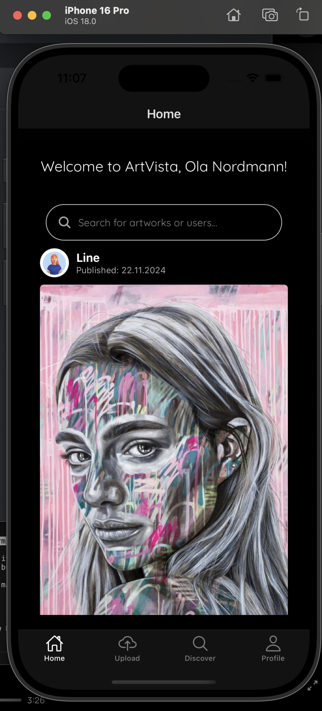
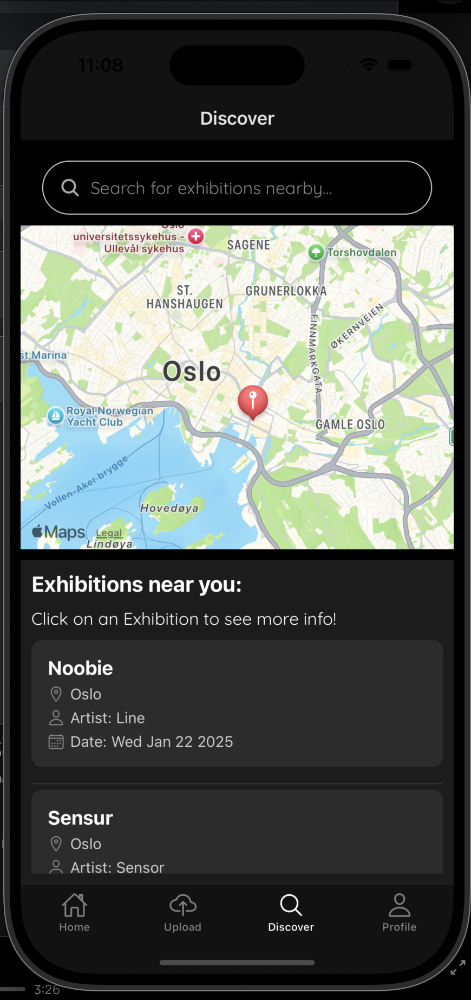
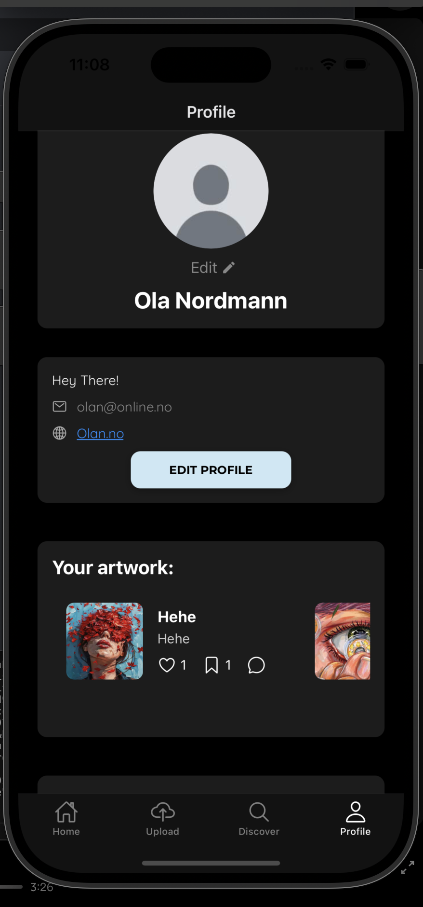
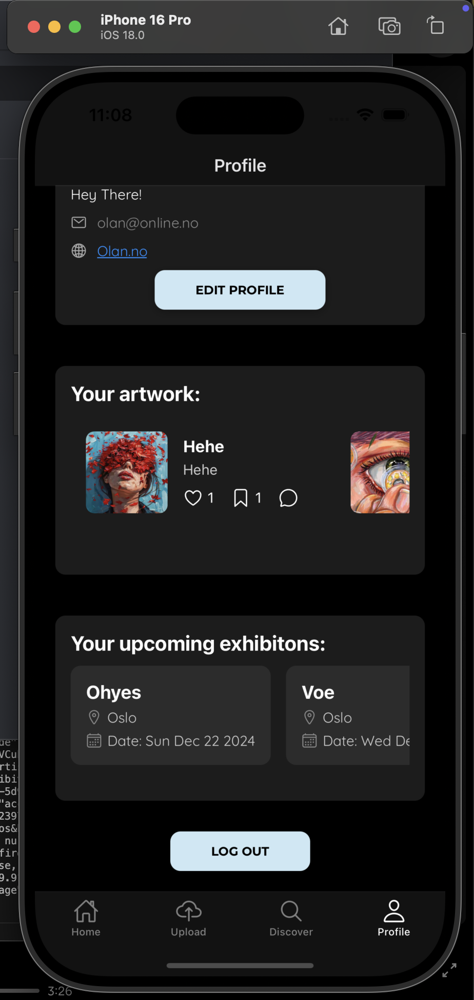

Eksamen i Kryssplattform 2024 - ArtVista

# Welcome to ArtVista! 👋

## Get started
1. npm install

2. npm run ios

## Funksjoner

### Minimum funksjoner:
- [x] Liste over et array med kunstverk som brukere har lastet opp
- [x] Detaljside om ett spesifikt maleri
- [x] Kunstnere kan laste opp malerier
- [x] Brukere må registrere seg eller logge inn for å få tilgang 
- [x] Enkel navigasjon mellom sidene
- [x] Bruker kan laste opp kunstverk via bildebibliotek eller kamera

### Tilleggsfunksjoner:
- [x] Bruker kan lagre, like og kommentere på postene
- [x] Bruker kan fjerne lagring, likes og sine egne kommentarer
- [x] Brukere kan søke etter navn på maleri eller kunstner 
- [x] Brukere kan trykke på en spesifikk utstilling og få mer informasjon
- [x] Brukere kan søke etter kunstnere og se deres profil, kunstverk og utstillinger
- [x] Profilside hvor bruker kan laste opp profilbilde, redigere profil og ha full oversikt over sine egne kunstverk og kommende utstillinger
- [x] Utforsk-side hvor bruker kan se og søke på utstillinger som er i nærheten

## Screenshots

1. Welcome 

2. Sign In

3. Sign Up

4. Home

5. Upload

6. Map

6. Profile

 